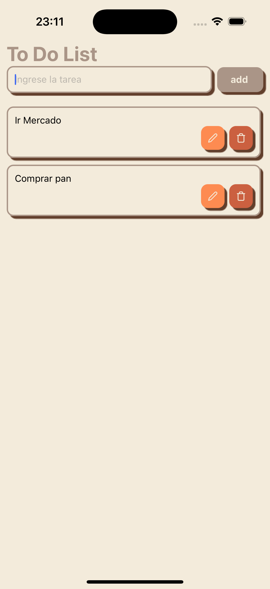

# Vintage To-Do List 📝

Un elegante y sencillo To-Do List inspirado en tonos vintage para organizar tus tareas diarias. Esta aplicación permite añadir, eliminar y gestionar tareas, todo en una interfaz limpia y acogedora que evoca un toque clásico.

## Características ✨
- **Añadir tareas**: Agrega nuevas tareas de manera sencilla.
- **Eliminar tareas**: Elimina tareas completadas o innecesarias.
- **Interfaz vintage**: Disfruta de una paleta de colores inspirada en tonos clásicos, brindando una experiencia visual relajante y única.

## Tecnologías Utilizadas 💻
- **React Native**: Framework principal para construir la aplicación.
- **Styled Components**: Utilizado para diseñar la interfaz con estilo vintage y garantizar consistencia en la presentación.
- **AsyncStorage**: Permite almacenar las tareas localmente en el dispositivo del usuario.